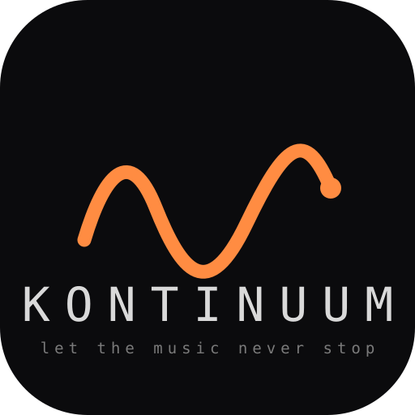

  <picture>
    <source media="(prefers-color-scheme: dark)" srcset="logo-dark.svg"/>
    
  </picture>

<code>let&nbsp;the&nbsp;music&nbsp;never&nbsp;stop</code>

<code>●&nbsp;&nbsp;•&nbsp;&nbsp;∙&nbsp;&nbsp;·</code>

## Music for everyone, composed for you, live, forever.

Kontinuum is not a streaming app and not a DAW. It is a **living instrument**: an AI composer performing on a deterministic real-time synthesizer engine in your pocket. It doesn't play recordings, it *writes and performs* music, continuously: minimal techno, house, deep house, acid, dub techno, ambient, and every style you add. It never stops, never repeats itself, and never needs the internet.

Recorded music is frozen, the same take for every listener, every time. Making music is gated behind years of practice and a thousand-euro plugin folder. Between the two sits almost everyone. Kontinuum closes that gap: music hyper-personalized to you, performed by an engine good enough that it simply sounds like a record.

## Three doors into the same music

| | You are… | Kontinuum gives you |
|---|---|---|
| **LISTEN** | anyone with ears | pick a style, press play. Steer it in plain words: *"darker"*, *"I'm working, keep it subtle"*, *"take me somewhere deeper"* |
| **DJ** | someone who wants to *perform* | a beat-locked performance row: filter sweeps, EQ kills, loop rolls, tension builds, deck A/B crossfades. Quantization does the timing, so it always sounds tight |
| **PRODUCE** | producers | a full agentic production studio. Every pattern, instrument, send and automation lane editable, including the live code stream itself. Tap a line, change it, hear it next bar |

There is no "musician version" and no "listener version". One session is running; how deep you reach into it is up to you.

## The bar

In a blind A/B test, an ordinary listener should not reliably distinguish a Kontinuum session from a professionally produced and mastered track sold on Beatport. Until that test passes, sound beats features.

## Built in the open

MIT-licensed. The engine, the musical language, the app, and the code that will meter every artist royalty, all inspectable by anyone.

One Rust core, one SwiftUI codebase, one song format: iPhone first, then iPad and a native Mac app.

**[Kontinuum-ai/kontinuum](https://github.com/Kontinuum-ai/kontinuum)** is the home of the project. It is private while the engine stabilizes, and opens as it ships.
